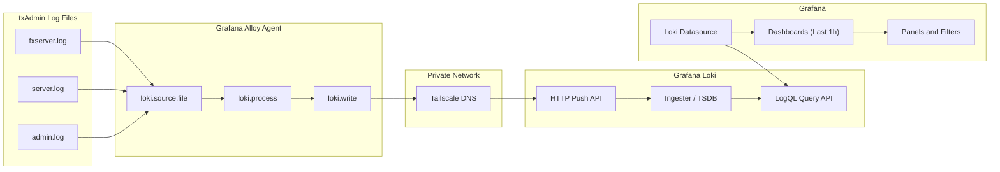

# Centralized Observability with Grafana Loki & Alloy

## Overview

This project demonstrates the design and implementation of a **centralized logging and observability platform** using **Grafana Loki**, **Grafana Alloy (Promtail successor)**, and **Grafana Dashboards**.

The solution focuses on **production-grade log ingestion**, **structured labeling**, **advanced querying**, and **operational visibility**, following modern **DevOps and SRE best practices**.

---

## Goals

- Centralize application and infrastructure logs
- Migrate from Promtail to Grafana Alloy
- Enable fast troubleshooting through structured labels
- Detect errors, exceptions, and abnormal behaviors using LogQL
- Provide reusable dashboards with dynamic filters

---

## Architecture

**Log Flow:**

```yaml
Application Logs (files)
↓
Grafana Alloy (loki.source.file)
↓
Loki Write API
↓
Grafana Loki (ingesters)
↓
Grafana Dashboards (LogQL)
```


**Key Components:**
- Grafana Alloy for log collection and processing
- Grafana Loki as centralized log storage
- Grafana for visualization and querying

---

## Technologies Used

- Grafana Loki
- Grafana Alloy
- Grafana Dashboards
- LogQL
- Linux (systemd)
- REST APIs
- Tailscale (private networking)

---

## Log Ingestion Configuration

Example Alloy configuration used for file-based log ingestion:

```hcl
loki.write "to_loki" {
  endpoint {
    url = "http://<loki-endpoint>:3100/loki/api/v1/push"
  }
}

loki.source.file "txadmin_current" {
  targets = [
    {
      __path__ = "/redm/server/txData/default/logs/fxserver.log",
      job      = "txadmin",
      app      = "fxserver",
      host     = "ohio-app"
    },
    {
      __path__ = "/redm/server/txData/default/logs/server.log",
      job      = "txadmin",
      app      = "server",
      host     = "ohio-app"
    },
    {
      __path__ = "/redm/server/txData/default/logs/admin.log",
      job      = "txadmin",
      app      = "admin",
      host     = "ohio-app"
    }
  ]

  forward_to = [loki.write.to_loki.receiver]
}
```

##LogQL Queries

Examples of queries used in dashboards:

Errors and Exceptions
```yaml
{job=~".+"} |~ "(?i)error|failed|exception|panic|timeout"
```

Script-based error detection
```yaml
{job=~".+"} |~ "\\[\\s*script:" |~ "(?i)error|failed|exception"
```

High-volume log sources
```yaml
topk(10, count_over_time({job=~".+"}[1m]))
```
##Dashboards

The Grafana dashboard includes:

- Error & exception counters
- High-volume script detection
- Log distribution per application
- Dynamic dropdown filters for:
 - Job
 - Host
 - Application
Time range default: Last 1 hour
📂 Dashboard JSON available in /dashboards

##Validation & Monitoring
- Loki readiness checks (/ready)
- Direct ingestion testing via /loki/api/v1/push
- Alloy internal metrics (/metrics)
- Zero dropped logs confirmed via write metrics

Lessons Learned
- Migrating from Promtail to Alloy requires adapting to a component-based pipeline model
- Label design directly impacts query performance
- Early validation via Loki APIs prevents silent ingestion failures
- Dashboards should prioritize operational clarity over raw data volume

##Future Improvements
- Alerting rules based on LogQL
- Multi-tenant Loki setup
- Log enrichment via processing stages
- Integration with metrics and traces (full observability stack)


Author

Adilio Santos
Platform / DevOps Engineer